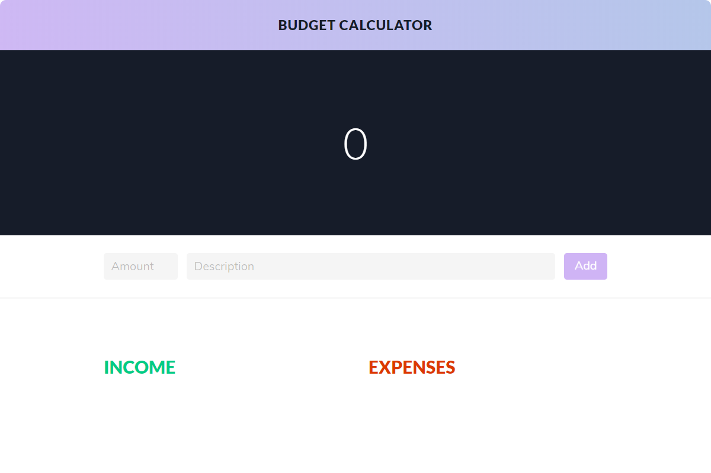
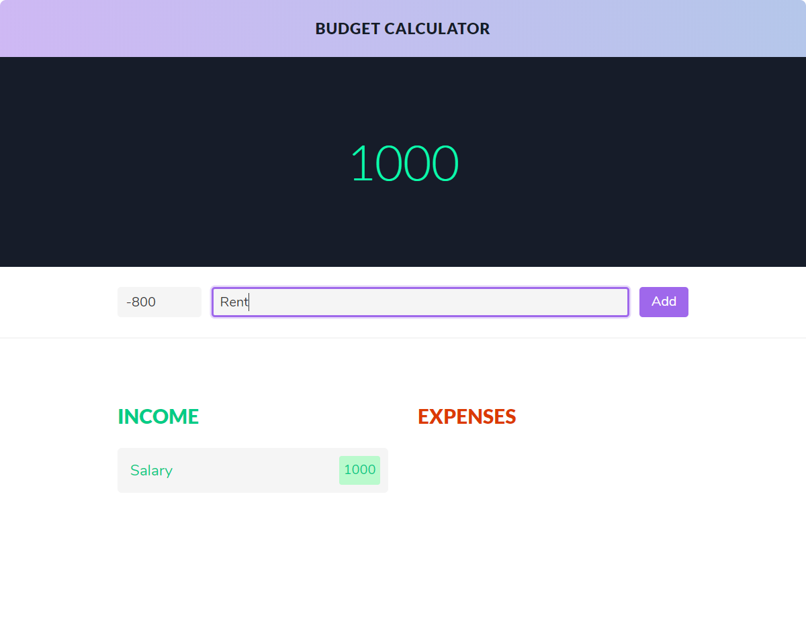
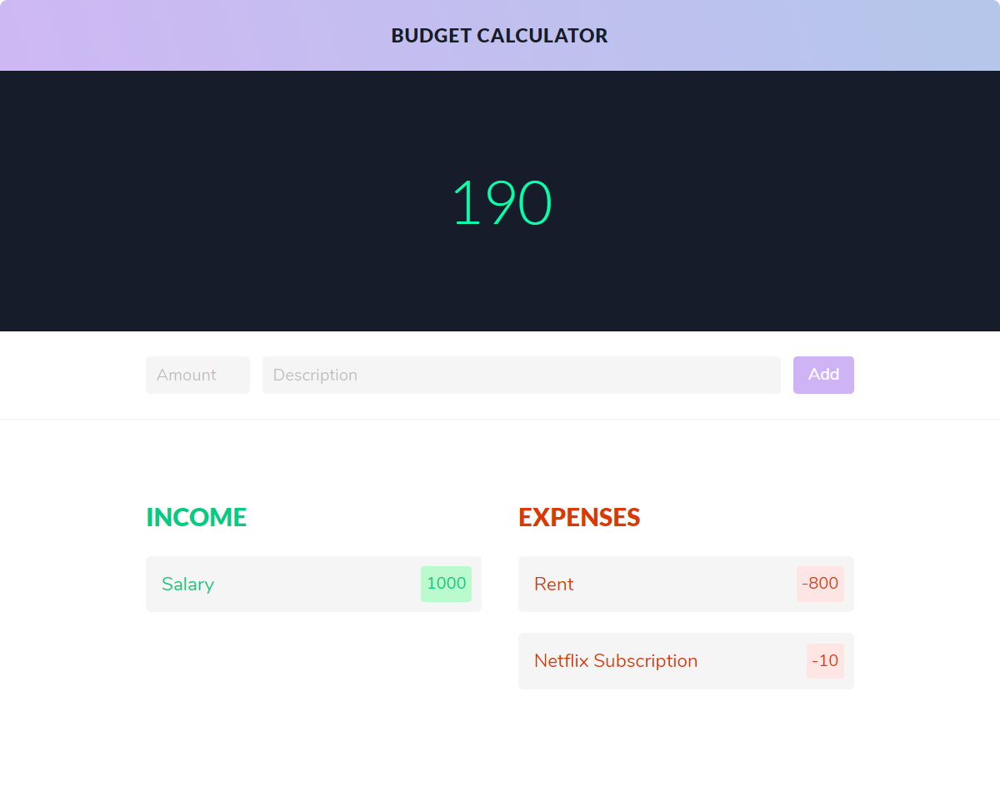
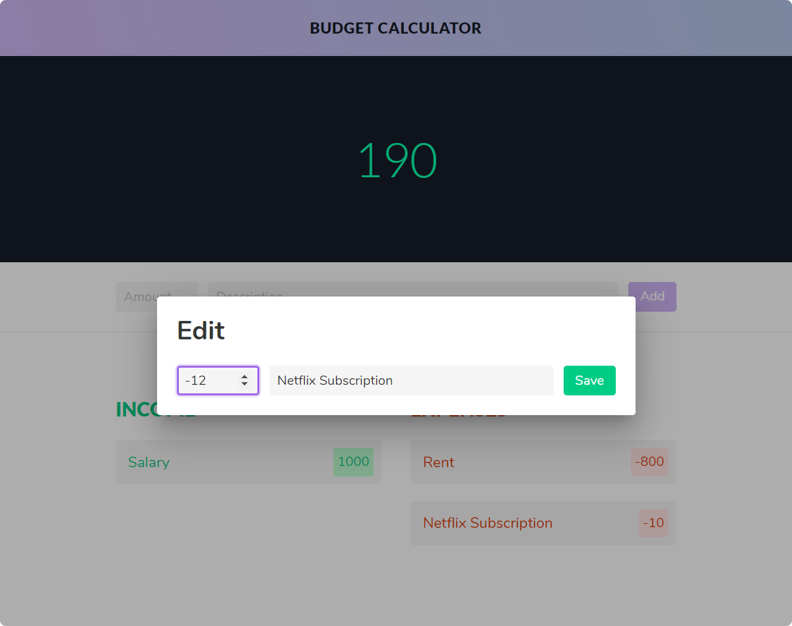

# Budget Calculator App (Angular)

## Screenshots

---

## Prerequisites

You must have installed node in your local machine as well as angular cli

## Installation

Clone this repository

Run `npm install`

Run `ng update`

Run `npm update`

Run `ng serve` for a dev server. Navigate to `http://localhost:4200/`. The app will automatically reload if you dont change any of the source files.`

